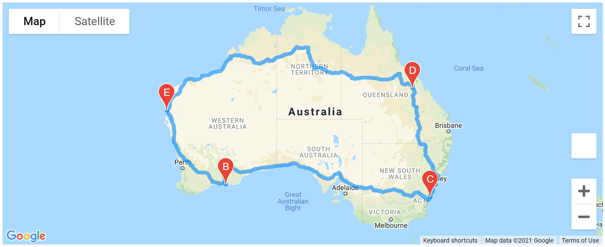

# World_Weather_Analysis
PlanMyTrip is a top travel technology company that specializes in internet related services in the hotel and lodging industry who had an employee collect weather data across cities worldwide and perform analysis so that the application can provide visual recommendations of ideal hotels based on clients' weather preferences.

## Overview of Project:
As part of Beta testing, PlanMyTrip got recommendations and some of which the company wants to incorporate.
Below is the list of recommendations that the company wants implemented.
1. Add the weather description to the weather data,
2. filter using the input provided by the beta testers on the weather preferences to identify potential travel destinations and list them out for the beta user,
3. the beta user will choose four cities based on which a travel itinerary needs to be created, and,
4. finally, create a travel route between the four cities as well as a marker layer map using the Google Maps Direction API.

## Requirements:
This new assignment consists of three technical analyses. 

### Deliverable 1: Retrieve Weather Data
Generate a set of 2,000 random latitudes and longitudes, retrieve the nearest city, and perform an API call with the OpenWeatherMap. In addition to the city weather data you gathered in this module, use your API skills to retrieve the current weather description for each city. Then, create a new DataFrame containing the updated weather data.

### Deliverable 2: Create a Customer Travel Destinations Map
Use input statements to retrieve customer weather preferences, then use those preferences to identify potential travel destinations and nearby hotels. Then, show those destinations on a marker layer map with pop-up markers.

### Deliverable 3: Create a Travel Itinerary Map
Use the Google Directions API to create a travel itinerary that shows the route between four cities chosen from the customer’s possible travel destinations. Then, create a marker layer map with a pop-up marker for each city on the itinerary.

## Implementation:
### Deliverable 1: Retrieve Weather Data
The collection code was updated to bring in Weather Description (for example, clouds, fog, light rain, clear sky) along with Latitude, Longitude, Maximum Temperature, Percent Humidity, Percent Cloudiness and Wind Speed for the cities. Refer [Weather Data Collection Code](Weather_Database/Weather_Database.ipynb) for the code and [Weather Data Output](Weather_Database/WeatherPy_Database.csv) for the output data file.

### Deliverable 2: Create a Customer Travel Destinations Map
The starter code provided was updated to -
1. import data from the Deliverable 1 output - [Weather Data Output](Weather_Database/WeatherPy_Database.csv),
2. capture Temperature criteria from the user,
3. filter the data set based on the criteria to get preferred destination cities,
4. retrieve the necessary data from openweathermap.org,
5. hotels were retrieved using Google Nearby Search,
6. finally, map with markers was generated using Google Maps API.

Refer [Vacation Search Code](Vacation_Search/Vacation_Search.ipynb) for the code and [Vacation Search based on temperature criteria Data Output](Vacation_Search/WeatherPy_vacation.csv) for the output data file.

### Deliverable 3: Create a Travel Itinerary Map
The starter code provided was updated to -
1. get data from Deliverable 2 output - [Vacation Search based on temperature criteria Data Output](Vacation_Search/WeatherPy_vacation.csv),
2. choose four cities that customer might want to visit,

 

3. generate map with directions layer for the four cities based on "DRIVING" travel mode as the cities are spread across Australia using Google Maps Directions API,
   

4. add markers layer with pop-up marker for each city from the four travel destinations.
 

Refer [Vacation Itinerary Code](Vacation_Itinerary/Vacation_Itinerary.ipynb) for the code.